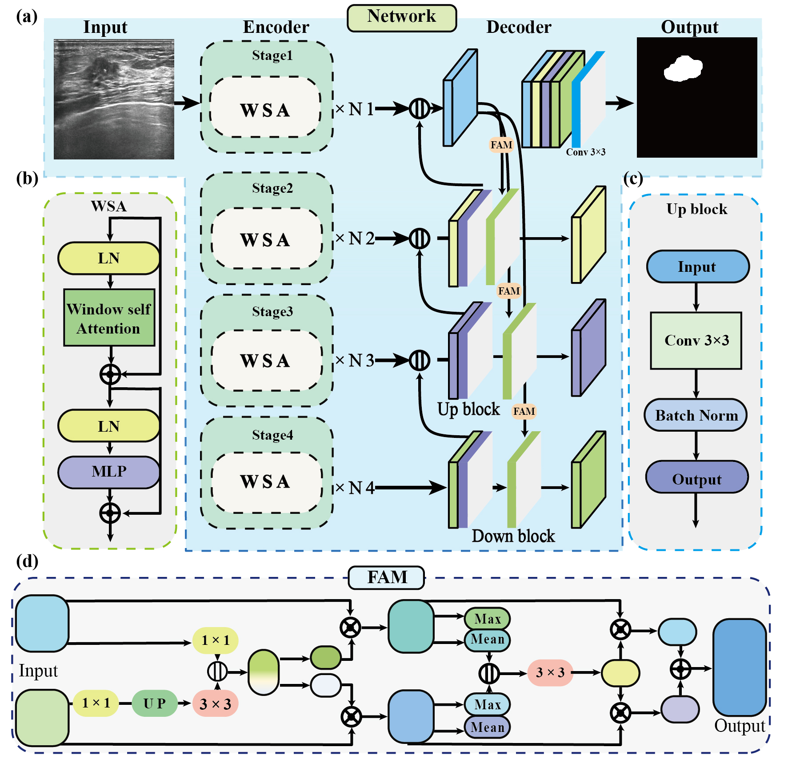
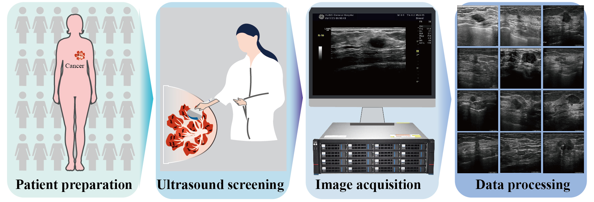
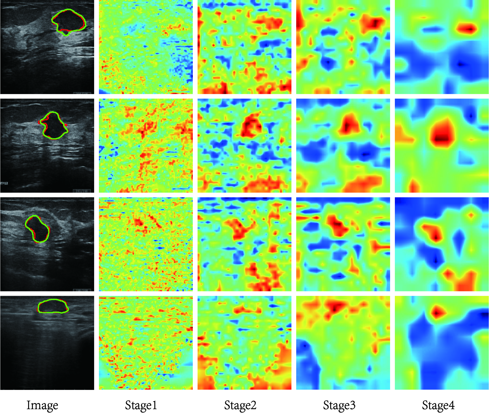
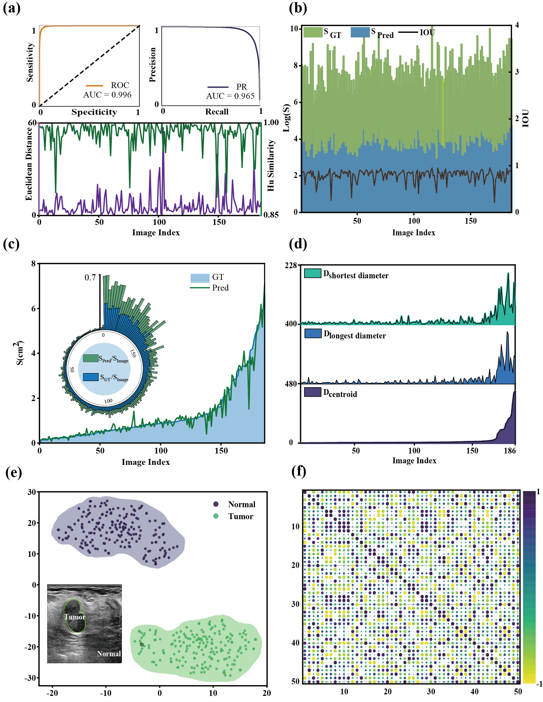

<h1 align="center">
  WSFANet
</h1>

<p align="center">
  
  <br>
  <rm>Figure 1: WSFANet Architecture</rm>
</p>

**📖Title：** Window Self-attention Guided Multiscale Feature Flow Alignment Network for Breast Cancer Ultrasound Image Segmentation

**👨‍💻Author：** Jin Huang, Jingwen Deng, Mengyuan Li, Jingwen Zhang, Du Wang, Liye Mei, Yimin Zhang, and Cheng Lei

**Link：** [](https://github.com/huangjin520/WSFANet)
 [Paper (coming soon)]()
[Project Website🔗](https://www.lei-whu.com)

**📜Abstract:** <p align="justify">
**Background:** Breast cancer is one of the most common diseases for female mortality worldwide. Clinically, ultrasound is frequently used for breast cancer diagnosis, but the process is repetitive and inefficient. Therefore, the medical field introduces computer vision to enhance breast ultrasound image segmentation efficiency. 

**Purpose:** Accurate segmentation remains challenging because of cancer characteristics, including shadows, speckles, and morphology variations. Nowadays, segmentation algorithms are mainly based on U-Net and fully convolutional networks. However, they utilize fixed receptive regions, causing insufficient global features. Meanwhile, some Transformer-based methods have been introduced, but their attention capacity remains insufficient for effective ultrasound image segmentation. Therefore, this paper proposes the window self-attention guided multiscale feature flow alignment network (WSFANet) to address these issues by window self-attention and multiscale feature flow alignment mechanism.

**Methods:** Firstly, our WSFANet employs window self-attention to extract features through a four-stage architecture. The window self-attention(WSA) mechanism extracts global features, because the WSA focuses on the cancer features without considering cancer morphology characteristics. Therefore, our network can delineate cancer boundaries and avoid shadows. Besides, the window self-attention mechanism focuses on global features while avoiding the fixed receptive region from CNN. Secondly, our network employs the feature flow alignment module (FAM) to fuse features from different dimensions. We utilize the multi-scale feature fusion to retain the neglected local features. Finally, we apply the FAM and the multi-scale module atrous spatial pyramid pooling to capture cancer features. Our proposed method can segment breast cancer boundaries without interfering with shadows, speckles, or morphology characteristics.

**Results:** We conduct extensive experiments on two public breast ultrasound image datasets BUSI and BUSI-WHU. Our WSFANet demonstrates consistently superior segmentation performance. Under 5-fold cross-validation, our model achieves a mean Intersection over Union (mIoU) of 90.07% on the BUSI-WHU, with a corresponding mean Precision of 94.64%, average symmetric surface distance (ASSD) of 6.03, and a Hausdorff distance at the 95th percentile (HD95) of 25.77. Notably, the across-fold mIoU averaged 89.5%, indicating strong stability and robustness. Furthermore, our model maintains competitive accuracy on another public BUSI dataset. Specifically, our model achieves an mIoU of 80.14%, mean Precision of 89.68%, ASSD of 8.03, and HD95 of 37.53. Moreover, in comparative experiments against nine state-of-the-art methods, our WSFANet consistently yielded the highest mIoU on both datasets. In particular, on BUSI-WHU, it outperformed all competing methods in terms of mIoU and Precision while simultaneously achieving lower HD95, demonstrating the effectiveness of the proposed integration of window self-attention, multiscale context modeling, and feature-flow alignment.

**Conclusions:** We propose an effective deep learning network for breast ultrasound image segmentation. The proposed network effectively leverages global and semantic features to capture diverse cancer characteristics and accurately segment cancer boundaries. The code is publicly available at https://github.com/huangjin520/WSFANet.</p>


# Introduction
This is an official implementation of [Window Self-attention Guided Multiscale Feature Flow Alignment Network for Breast Cancer Ultrasound Image Segmentation](). ...


## 🚀 Quick start
### 1️⃣ Installation
Assuming that you have installed PyTorch and TorchVision, if not, please follow the [officiall instruction](https://pytorch.org/) to install them firstly. 
Intall the dependencies using cmd:

``` sh
python -m pip install -r requirements.txt --user -q
```

All experiments use the PyTorch 1.8 framework in a Python 3.10 environment. Other versions of pytorch and Python are not fully tested.
### 📂 Data preparation
We have evaluated segmentation performance on two public datasets [BUSI](https://www.sciencedirect.com/science/article/pii/S2352340919312181), [BUSI-WHU](https://data.mendeley.com/datasets/k6cpmwybk3/3). Please prepare the data as following:

``` sh
|-DATASET
  |-BUSI-WHU
    |-train
    | |-img
    | |-mask
    |-val
    | |-img
    | |-mask
    |-test
    | |-img
    | |-mask

```
<p align="center">
  
  <br>
  <rm>Figure 2:  Sample processing and image acquisition. </rm>
</p>

### Training
The WSFANet model can be trained on BUSI-WHU training set using the following: 

```
python train_BUSI_WHU.py 
``` 

The parameters of the model have been carefully designed. 

WSFANet - Hardware: an NVIDIA RTX 3090 GPU and an Intel Core i9-10900X CPU.


## 📊 Evaluation
The WSFANet model can be evaluated on BUSI-WHU validation set using the following: 

```
python eval.py 
``` 
<p align="center">
  
  <br>
  <rm>Figure 2:  Attention map visualization of multiscale from stage 1 to stage 4. The network progressively captures the accurate segmentation results of the cancer. Blue for lower attention, red for higher attention. </rm>
</p>

**Table**: Quantitative performance on BUSI-WHU. Best in <span style="color:#F28D6A">red</span>, second best in <span style="color:#5D9CEC">blue</span>.

| Method | mean Precision (%) | mean Recall (%) | OA (%) | Pe (%) | Kappa (%) | mean F1 (%) | mean IOU (%) | HD95 | ASSD |
|---|---:|---:|---:|---:|---:|---:|---:|---:|---:|
| MGCC<sub>2023</sub> | 92.58 | 96.37 | <span style="color:#F28D6A">98.55</span> | 87.09 | <span style="color:#5D9CEC">88.76</span> | 94.38 | <span style="color:#5D9CEC">89.76</span> | <span style="color:#F28D6A">23.59</span> | <span style="color:#5D9CEC">5.38</span> |
| CMUnet<sub>2023</sub> | <span style="color:#5D9CEC">93.17</span> | 92.34 | 98.03 | 86.41 | 85.5 | 92.75 | 87.11 | 33.16 | 8.79 |
| P-CD<sub>2023</sub> | 92.3 | 95.04 | 98.34 | 86.95 | 87.24 | 93.62 | 88.51 | 39.81 | 8.54 |
| Unet<sub>2015</sub> | 91.86 | 94.39 | 98.19 | 86.93 | 86.16 | 93.08 | 87.64 | 31.85 | 7.32 |
| TransUnet<sub>2021</sub> | 87.83 | 93.58 | 97.6 | <span style="color:#5D9CEC">87.42</span> | 80.94 | <span style="color:#F28D6A">97.6</span> | 83.63 | 54.19 | 10.74 |
| MDAnet<sub>2022</sub> | 89.49 | <span style="color:#F28D6A">97.39</span> | 98.28 | <span style="color:#F28D6A">87.65</span> | 86.04 | 87.55 | 87.55 | 27.20 | 6.40 |
| DSEUnet<sub>2023</sub> | 91.78 | <span style="color:#5D9CEC">96.43</span> | 98.46 | 87.21 | 87.93 | 93.96 | 89.07 | 26.39 | 5.85 |
| MpmsCfma<sub>2024</sub> | 90.76 | 94.24 | 98.04 | 87.07 | 84.83 | 92.41 | 86.58 | 38.14 | <span style="color:#F28D6A">5.36</span> |
| DualAnet<sub>2024</sub> | 92.58 | 93.91 | 98.21 | 86.75 | 86.47 | 93.23 | 87.88 | 36.92 | 7.77 |
| **WSFAnet (ours)** | <span style="color:#F28D6A">94.64</span> | 94.51 | <span style="color:#5D9CEC">98.54</span> | 86.53 | <span style="color:#F28D6A">89.15</span> | <span style="color:#5D9CEC">94.57</span> | <span style="color:#F28D6A">90.07</span> | <span style="color:#5D9CEC">25.77</span> | 6.03 |

<p align="center">
  
  <br>
  <rm>Figure :  Visual explanations of 186 test set segmentation results on the BUSI-WHU dataset. (a) the PR curve, ROC curve, Euclidean distance, and Hu similarity. The PR and ROC's AUCs (Area Under the Curve) are 0.965 and 0.996, respectively. (b-d) Display the GT and predication cancer masks of 186 images on the BUSI-WHU. (d) Display the shortness, longest, and centroid of the predication contours (e) The t-SNE illustrates the features distribution of cancer and normal tissue. (f) Correlation among 50 ultrasound image samples on the BUSI-WHU. The different values demonstrate the better diversity of the BUSI-WHU test set. </rm>
</p>
**Table 4**: Comparing our method (WSFANet) with the state-of-the-art methods on the BUSI dataset. The best results are <span style="color:#F28D6A">red-marked</span>, and the next best are <span style="color:#5D9CEC">blue-marked</span>. Rows 0–3 are task-specific algorithms, while rows 4–9 are general segmentation algorithms.  

| Method | mean Precision (%) | mean Recall (%) | OA (%) | Pe (%) | Kappa (%) | mean F1 (%) | mean IOU (%) | HD95 | ASSD |
|---|---:|---:|---:|---:|---:|---:|---:|---:|---:|
| MGCC<sub>2023</sub> | 88.16 | 87.15 | <span style="color:#5D9CEC">95.86</span> | 83.25 | <span style="color:#5D9CEC">75.29</span> | 77.57 | 79.45 | 71.80 | 24.20 |
| CMUnet<sub>2023</sub> | 87.63 | 86.01 | 95.54 | 83.10 | 73.59 | 86.80 | 78.28 | <span style="color:#5D9CEC">76.57</span> | 20.99 |
| P-CD<sub>2023</sub> | 83.90 | <span style="color:#5D9CEC">87.41</span> | 95.45 | <span style="color:#F28D6A">84.24</span> | 71.11 | 85.55 | 76.68 | 99.28 | 24.19 |
| Unet<sub>2015</sub> | 86.47 | 87.26 | 95.70 | 83.65 | 73.72 | 86.86 | 78.39 | 92.86 | 22.96 |
| TransUnet<sub>2021</sub> | 82.42 | 84.34 | 94.65 | <span style="color:#5D9CEC">83.93</span> | 66.69 | 83.35 | 73.85 | 150.16 | 38.11 |
| MDAnet<sub>2022</sub> | 83.80 | 86.83 | 95.32 | 84.15 | 70.47 | 85.23 | 76.26 | 88.03 | 27.69 |
| DSEUnet<sub>2023</sub> | <span style="color:#5D9CEC">88.18</span> | 87.40 | <span style="color:#5D9CEC">95.92</span> | 83.30 | <span style="color:#F28D6A">75.57</span> | <span style="color:#5D9CEC">87.79</span> | <span style="color:#5D9CEC">79.65</span> | <span style="color:#F28D6A">67.40</span> | <span style="color:#5D9CEC">19.59</span> |
| MpmsCfma<sub>2024</sub> | 82.74 | 85.25 | 94.88 | 84.06 | 67.87 | 83.93 | 74.59 | 98.31 | 32.22 |
| DualAnet<sub>2024</sub> | 86.89 | 81.14 | 94.11 | 81.92 | 67.41 | 83.69 | 74.14 | 109.12 | 27.91 |
| **WSFANet (ours)** | <span style="color:#F28D6A">89.68</span> | 86.76 | <span style="color:#F28D6A">95.98</span> | 83.02 | <span style="color:#5D9CEC">76.30</span> | <span style="color:#F28D6A">88.15</span> | <span style="color:#F28D6A">80.14</span> | <span style="color:#5D9CEC">37.53</span> | <span style="color:#F28D6A">8.03</span> |


## 📜 Citation
If you find this work or code is helpful in your research, please cite:
### 📌 1. WSFANet 
Coming soon...
### 📌 2. EMGANet (JBHI 2025)
EMGANet (JBHI 2025)[IEEE Xplore🔗](https://ieeexplore.ieee.org/document/10906450) [Github🔗](https://github.com/huangjin520/EMGANet) [Project Website🔗](https://www.lei-whu.com)
```
J. Huang et al., "EMGANet: Edge-Aware Multi-Scale Group-Mix Attention Network for Breast Cancer Ultrasound Image Segmentation," in IEEE Journal of Biomedical and Health Informatics, doi: 10.1109/JBHI.2025.3546345.
```

### 📌 3. DSATNet (Medical Physics 2025)
DSATNet (MP 2025)[Wiley 🔗](https://aapm.onlinelibrary.wiley.com/doi/10.1002/mp.17751) [Github🔗](https://github.com/Skylanding/DSATNet) [Project Website🔗](https://www.lei-whu.com)
```
Li Y, Huang J, Zhang Y, et al. Dual branch segment anything model‐transformer fusion network for accurate breast ultrasound image segmentation[J]. Medical Physics.
```
## 📬 Contact
For any questions or collaborations, please contact [Jin Huang](mailto:jinhuang@whu.edu.cn) or open an issue on GitHub.


****